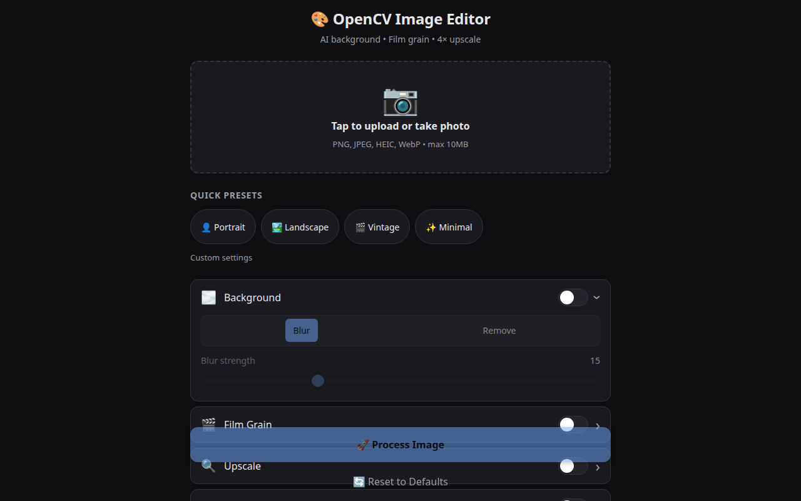
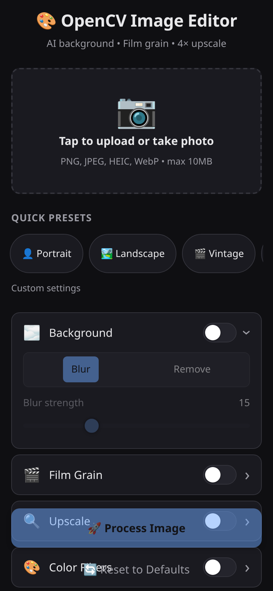

# OpenCV Image Editor

Mobile-first AI image editor — background blur/removal, film grain, 4× AI upscale, color filters. One Docker container, no cloud, runs on a CPU.

   

---

## 📸 Screenshots

| Desktop | Mobile |
| --- | --- |
|  |  |

---

## ✨ Features

### 🎨 Editing
- **Background** — blur or remove with U2NetP matting (ONNX). Adjustable blur strength (1–50).
- **Film grain** — luminance-aware, Rec.601-weighted noise that preserves subject detail.
- **AI upscale** — 2× / 4× via OpenCV DNN `cv2.dnn_superres.EDSR` with LANCZOS4 fallback.
- **Filters** — brightness, contrast, saturation, sharpness, sepia, grayscale, blur, vignette, unsharp mask, auto-enhance.
- **Before/after comparison** — side-by-side and diff overlay.
- **Presets** — one-tap *Portrait*, *Landscape*, *Vintage*, *Minimal*.

### 🌐 Web UI
- Mobile-first PWA — installable on iOS/Android, works offline after first load.
- Dark theme, no build step, vanilla JS — total client payload < 30 KB.
- Server-side rendering of the comparison image so the download is one tap.

### 🛡️ Production
- Per-IP rate limiting (`slowapi`).
- Prometheus metrics on a separate port (`:9090`).
- Health endpoint, structured errors, request size accounting.
- Image size and dimension limits enforced server-side.
- Multi-stage Docker build — model files baked in at build time, no runtime download.

---

## 🚀 Getting Started

You need **Docker** (20.10+) and **~2 GB of free disk** for the image. That's it.

```bash
git clone <repo-url>
cd opencv-image-edit
docker compose up -d
```

Open **http://localhost:8000** in your browser. The first request after boot takes ~3 s while the AI models warm up; subsequent requests are sub-second.

> **Updating:** `docker compose pull && docker compose up -d`
> **Stopping:** `docker compose down` (your settings and temp files live in Docker volumes and survive restarts).

---

## 📖 Usage

1. **Pick an image.** Tap the upload area, choose a file, or use the camera. PNG, JPEG, WebP, and HEIC/HEIF are all accepted (max 10 MB, max 1536 px on the long edge).
2. **Pick a preset** — or skip and dial in the controls manually.
3. **Tap Process.** The result appears below in ~1 s. Use the before/after slider to compare.
4. **Download** the result as PNG. If background removal was on, the PNG is RGBA so the alpha channel survives.

### Presets

- **👤 Portrait** — soft background blur + light grain + 2× upscale + slight color punch.
- **🏞️ Landscape** — vivid colors + auto-enhance + 2× upscale (no grain).
- **🎬 Vintage** — strong grain + sepia + vignette, no upscale.
- **✨ Minimal** — background removal only, transparent PNG output.

All settings in a preset are exposed as sliders and toggles in the UI — you can tweak them after picking the preset.

---

## 🔧 Configuration

All settings are environment variables. Override them in `docker-compose.yml` or a `.env` file.

| Variable | Default | Description |
| --- | --- | --- |
| `HOST` | `0.0.0.0` | Bind address. |
| `PORT` | `8000` | HTTP port (UI + API). |
| `DEBUG` | `false` | Enable FastAPI debug mode. |
| `LOG_LEVEL` | `INFO` | One of `DEBUG`/`INFO`/`WARNING`/`ERROR`/`CRITICAL`. |
| `MAX_IMAGE_SIZE_MB` | `10` | Reject uploads larger than this. |
| `MAX_IMAGE_DIMENSION` | `1536` | Downscale uploads whose long edge exceeds this. |
| `MODEL_DIR` | `./models` | Where U2NetP / EDSR weights live. |
| `RATE_LIMIT_REQUESTS` | `10` | Per-IP request budget. |
| `RATE_LIMIT_PERIOD` | `60` | Window for the rate limit, in seconds. |
| `ENABLE_METRICS` | `true` | Expose Prometheus metrics. |
| `METRICS_PORT` | `9090` | Port for the metrics endpoint. |

Copy `.env.example` to `.env` and edit — Docker Compose picks it up automatically.

---

## 🏗️ Architecture

The whole app is one FastAPI process plus a static PWA. The pipeline is a single OpenCV 5 graph — every stage reads BGR frames in and writes BGR frames out, so there is no round-trip through PIL, no `torch`, and no `rembg`. The only AI model that touches the image is the U2NetP matting network (ONNX Runtime), and the AI upscaler is `cv2.dnn_superres.EDSR` (shipped inside `opencv-contrib-python-headless`).

The pipeline orchestrator (`app/pipeline/__init__.py`) chains **preprocess → background → grain → upscale → filters → compare** as a single function call. Each stage can be enabled/disabled independently; the orchestrator is the only place that knows about ordering. This is what makes presets possible — a preset is just a `ProcessRequest` with some fields set.

The HTTP layer (`app/api/`) is intentionally thin: `health`, `presets`, and `process`. The static PWA lives in `web/` and is mounted at `/`. The whole thing is small enough that a single `python -m app.main` brings it up; Docker just standardises the environment and bakes in the model weights.

---

## 🛠️ Development

You need **Python 3.12+**.

```bash
# 1. Get the code
git clone <repo-url>
cd opencv-image-edit

# 2. Virtual env
python3.12 -m venv .venv
source .venv/bin/activate

# 3. Dependencies
pip install -r requirements.txt

# 4. Download model weights (U2NetP + EDSR x2/x4)
python scripts/download_models.py ./models

# 5. Run
python -m app.main
# → http://localhost:8000
```

The dev loop is `uvicorn app.main:app --reload` if you want hot reload; the included `python -m app.main` is the production entrypoint and reads the same env vars.

### Project layout

```
opencv-image-edit/
├── app/
│   ├── api/          # FastAPI routers (health, presets, process)
│   ├── pipeline/     # preprocess, background, grain, upscale, filters, compare
│   ├── config.py     # pydantic-settings
│   └── main.py       # FastAPI app + lifespan
├── web/              # Static PWA (HTML/CSS/JS/manifest/SW/icons)
├── scripts/          # download_models.py + tests
├── tests/            # pytest suite
├── docs/             # screenshots, design notes
├── Dockerfile        # multi-stage, ~1.3 GB final image
├── docker-compose.yml
└── requirements.txt
```

---

## 🧪 Testing

```bash
source .venv/bin/activate
pytest tests/ -q
```

The suite is ~80% coverage on the pipeline; the AI models are exercised in tests that explicitly require the matting model (and skip if it's not on disk). Use `pytest -m "not slow"` to skip the AI-dependent tests.

---

## 🐛 Troubleshooting

**`Bind for 0.0.0.0:8000 failed: port is already allocated`**
Something else is using port 8000. Either stop it, or remap in `docker-compose.yml`:
```yaml
ports:
  - "8765:8000"
  - "9765:9090"
```

**First request takes 5–10 s**
That's the AI models warming up (U2NetP + EDSR). Subsequent requests are sub-second. The warmup is also why the Docker healthcheck has a 30 s `start_period`.

**HEIC files from iPhone aren't loading**
Make sure `pillow-heif` is installed — it is in `requirements.txt`. If you built a custom image without it, rebuild with `docker compose build --no-cache`.

**`429 Too Many Requests` immediately**
Default is 10 requests per 60 s per IP. Raise `RATE_LIMIT_REQUESTS` and `RATE_LIMIT_PERIOD` in your `.env`, then `docker compose up -d`.

**`Image too large` on a 5 MB JPEG**
After the on-disk size check, we also downscale anything whose long edge exceeds `MAX_IMAGE_DIMENSION` (default 1536 px). Lower the dimension in `.env` for very large images.

**Models missing inside the container**
The Dockerfile downloads them at build time. If you started the container before the download finished, rebuild: `docker compose build --no-cache`.

**`pillow_heif.register_heif_opener()` error on startup**
You installed `opencv-image-edit` somewhere that doesn't have `pillow-heif` in the same venv. `pip install -r requirements.txt` in the same interpreter.

---

## 📜 License

MIT — see `LICENSE` (or just use it; the intent is permissive).

---

## 🙏 Credits

- **U2NetP** matting model — [danielgatis/rembg](https://github.com/danielgatis/rembg) (Apache 2.0).
- **EDSR** super-resolution model — [Saafke/EDSR_Tensorflow](https://github.com/Saafke/EDSR_Tensorflow) (MIT).
- **OpenCV 5** — [opencv.org](https://opencv.org) (Apache 2.0).
- **FastAPI** — [fastapi.tiangolo.com](https://fastapi.tiangolo.com) (MIT).
- **ONNX Runtime** — [onnxruntime.ai](https://onnxruntime.ai) (MIT).
- **Prometheus** client — [prometheus.io](https://prometheus.io) (Apache 2.0).
